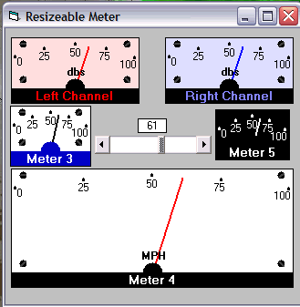



## Meter Analog Resizeable \(updated again\)

### Description

Rainy week-end project.Resizeable meter with several property options. Sorry only one range though (0 to 100).update: added gradient bkgd so it can look like its backlit.update:made a couple of changes,one thanks to Emad.Also added two more ucmeters I was playing around with.
 
### More Info
 

             |
---                |---
**Submitted On**   |2009-12-10 13:57:26
**By**             |[Kenneth Foster](https://github.com/Planet-Source-Code/PSCIndex/blob/master/ByAuthor/kenneth-foster.md)
**Level**          |Intermediate
**User Rating**    |4.8 (43 globes from 9 users)
**Compatibility**  |VB 6\.0
**Category**       |[Custom Controls/ Forms/  Menus](https://github.com/Planet-Source-Code/PSCIndex/blob/master/ByCategory/custom-controls-forms-menus__1-4.md)
**World**          |[Visual Basic](https://github.com/Planet-Source-Code/PSCIndex/blob/master/ByWorld/visual-basic.md)
**Archive File**   |[Meter\_Anal21699912102009\.zip](https://github.com/Planet-Source-Code/kenneth-foster-meter-analog-resizeable-updated-again__1-72691/archive/master.zip)

